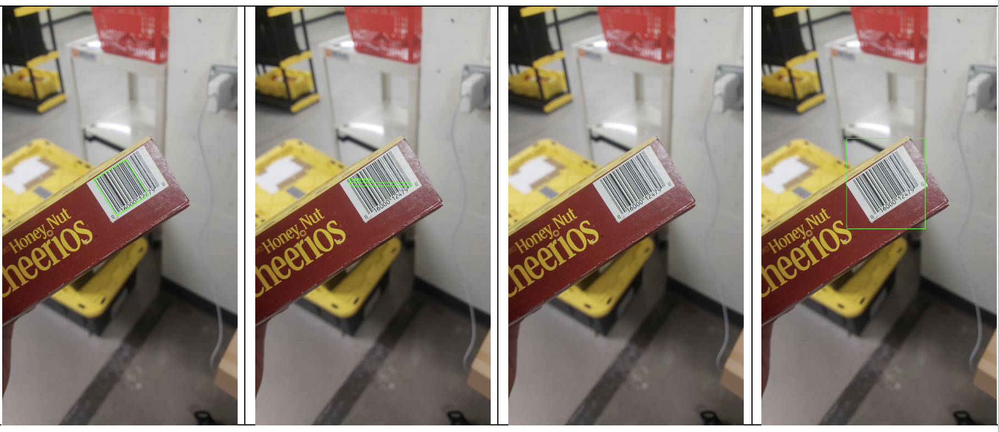
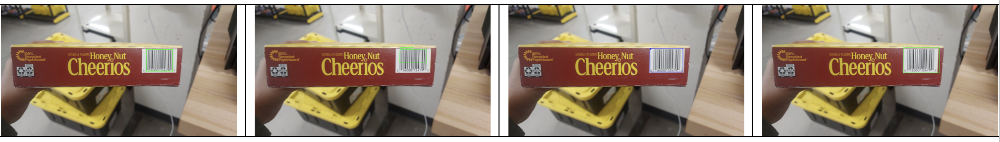
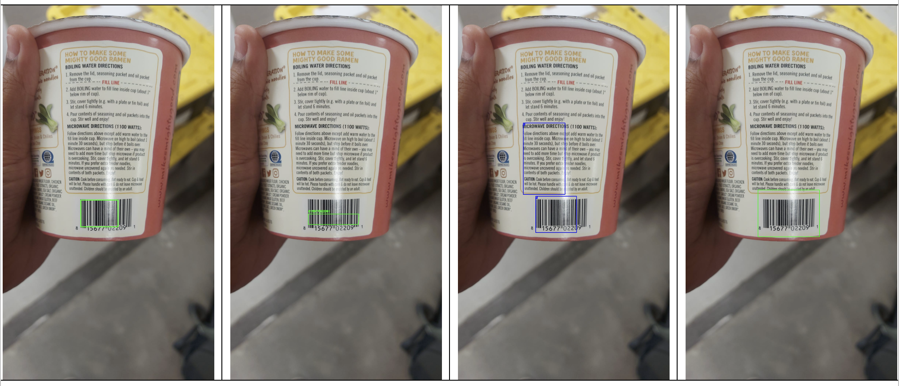
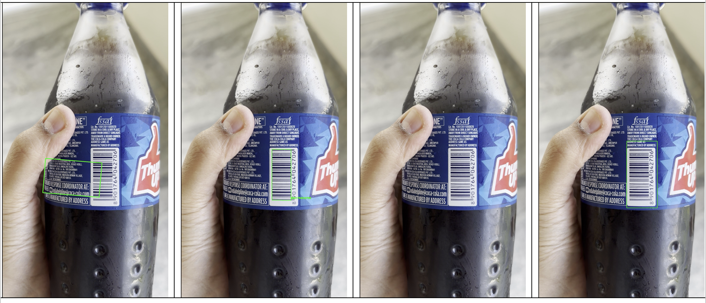
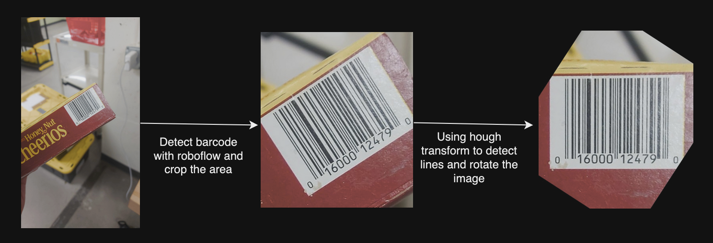
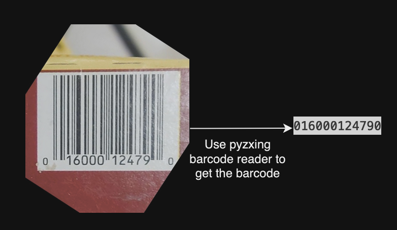

## Shelfhelp - Fall 2023 Product identification


This repository contains experiments done on visual representation learning models and Barcode detection. Here are the list of things which will be elaborated further below
1. Use Image processing techniques to detect barcode as a baseline model.
2. Object detection for rotated 1D barcode using Maximal Stable Extremal Region (MSER) method.
3. Test different methods like pyzbar, pyzxing to read barcodes.
4. Barcode detection using Roboflow and rotating using Hough transform lines.
5. Add ChatGPT to be used for answering queries about the product.
6. Use Openai whisper and text to audio feature to communicate.


As a part of my independent study for Fall 2023, I worked with Shivendra Agrawal who is currently working towards developing a smartcane to help visually impaired and blind people to guide them in grocery shopping.

During my independent study, I tested visual representation learning models, developed barcode detector and built an end to end pipeline which takes in live video input to detect the barcode and further answer queries about the product. In this process, I read research papers and blogs about MAE, PAWS for visual representation learning and few papers on barcode detection. Created a pipeline for identifying the product and querying about the same, used ChatGPT and Openai whispers in my project for communication.

## Papers:
- 
- 
- 
- 
- 

## Blogs:
- https://medium.com/invisible-insights/barcode-detection-using-deep-learning-techniques-1abde201df08
- https://blog.roboflow.com/read-barcodes-computer-vision/
- https://platform.openai.com/docs/guides/speech-to-text/quickstart
- https://baresquare.com/blog/use-openai-chatgpt-with-python
- https://github.com/dchakour/Barcode-detection


## Barcode detection:

Imagine a visually impaired person is trying to buy few food products in the grocery store. Shelf help's camera can act as eyes and help find and learn about different products. 

A person can scan through the products one after the other, and the algorithm detects the product, voicing out the name of the product the person is holding. If the person finds a product but would like to inquire about it to get more information, such as nutrition facts, allergens, protein content, ingredients, etc., this algorithm is designed to assist. The person can engage in a conversation to learn more about the product.

Here is the pipeline and step by step working of the workflow.
1. Input to the pipeline can be live video or recorded videos. In the video, the product must be scanned to show all sides of the product.

2. The algorithm uses the Roboflow barcode detection algorithm to identify barcodes in the frame. For higher speed, the algorithm is run every 30 frames.

3. The barcode is cropped, and a Hough line transform is employed to detect the angle of the barcode.

4. The barcode is then rotated by the determined angle, ensuring it becomes horizontal.

5. The pyzbar and pyzxing libraries are utilized to decode the barcoded image.

6. For database access, the Openfoodfacts API (https://world.openfoodfacts.org/api/v0/product/%20) is employed to retrieve product information in JSON format.

7. Necessary information is filtered from the JSON and sent to the GPT-3.5 API.

8. Simultaneously, a Text-to-Audio feature is utilized to voice over the product name.

9. If the identified product is not the target, the person can say "continue" to proceed with scanning other products.

10. If the target product is reached, the person can proceed to query information about the product if needed.

11. OpenAI whisper is used to convert speech to text with accuracy

The image below shows the process pipeline.


## Setup:
1. Clone the repository ``` git clone https://github.com/Shanthi-Lekkala/ProductIdentification.git```
2. Create a new virtual env with python-3.9.12  ```conda create -n env python=3.9.12```
2. Install the requirements ```pip install -r requirements.txt```
3. Set the OpenAI API key in *utils/config.py* 
4. Run main.py, ```python main.py```

## Experiments:
1. Detecting Barcode with Image processing techniques: 
  - Compute Gradient magnitude representations of the image in both x and y directions, apply thresholding, apply morphological operation to close gaps between bars, find countours and draw a rectangle.
  - Observations:
    1. This method can detect barcodes very fast, but they might not be accurate.
    2. It can also detect angled barcodes and give us a rotated rectangle
2. Detection based on MSER:
  - It takes advantage of Maximal Stable Extremal Region (MSER) system introduced by _"Robust wide baseline stereo from maximally stable extremal regions"_
  - Observations:
    1. The detection is more robust when compared to the above method
    2. It does not detect and mark the entire barcode
3. Pretrained Tiny yolo model:
  - Used a pretrained model from github and analysed its performance. 
  - It's inference time is less in comparision to yolo model as it is a lighter model
  - Performance of the model was not great in case of images with rotated barcodes
4. YOLOv5 model trained on ArteLab Barcode dataset
  - This model is trained from scratch using darkent yolov5 model
  - Converted the dataset to yolo trainable format and trained the model. The mAP of the final model is 54.8 and its performance is low when the barcode is at angle.
5. Pretrained model from Roboflow for barcode detection 
  - Loaded a pretrained model from roboflow to detect barcodes
  - Its performance is the best in comparision to all the other models.
  - It works good on images with rotated barcodes as well. 
  - The inference time is high compared to tiny yolo model. So, we are running one frame in every 30.

## Results: 

Here are the results showing images with barcodes of few products in the order of Image processing methos, MSER method, trained YOLO method and pretrained roboflow API method.

Testing on image with tilted barcode


Testing on a normal product image where the barcode is horizontal


Testing on cureved surfaced product image


Testing on product where the barcode is vertically aligned


## Observations:

1. Result from image processing methos are not highly reliable as it can even detect lines on the product to be a barcode as shown in the last example
2. MSER method is not detecting the barcode completely, while pyzbar can decode the barcode this way it is difficult in cases like example 1, where rotated barcode is detected as barely a line
3. YOLOv5 model trained from scratch on ArteLab dataset is not returning results as expected, in few images it is not able to detect the barcode like the rotated one and in some cases it wrongly chooses product info area to be a barcode like in example 3
4. Out of all the methods tried and tested, roboflow pretrained model API is performing the best producing results as expected. It is able to detect rotated barcode like in example 1 as well as vertical barcodes like in example 4

## Barcode Alignment: Image Rotation
Barcode decoders require barcodes to be horizontally aligned. So, as we get bbox of the rotated barcode from the image, we need to rotate it such that it is horizontally aligned. First, bbox is cropped from the image, then hough line transform is used to find lines and get the angles of them. Most common angle is used to get the angle of the barcode and the image is rotated accordingly. Here is an example which depicts this.



## Barcode decoders

We need a decoder to convert the barcode image to numerical values. After testing multiple barcode decoders in python like pyzbar, zbar, zbarlight, EAN13, zxingcpp, pyzxing, I added pyzxing for decoding the barcode from the image. Here is an image showing the same. 



## Product Information retrieval

## ChatGPT-Powered Product Q&A
What if a person wants to know more about the product before deciding whether or not to buy the product?
Here are few questions one might be curious to know about before deciding:
  1. Is it artificially flavored?
  2. What are the ingredients?
  3. What type of sweetener is used?
  4. What are the health benefits
  5. What are the allergens?
  6. What is the protein content?
  7. Vitamin and mineral information
  8. What is the Sugar content in the product?
  9. Number of servings?
  10. Calorie and nutrition facts?
ChatGPT is sent the first message about the product information as a json, which can help it answer the queries. 

As it is difficult to read or type in the question for visually impaired people, I added text to audio and speech to text features. The person can record the voice and OpenAI whisper is used to convert it to text, which is further sent to ChatGPT and the response is voiced out to the user using the text to audio feature.

## Future work:
- The working of the current model is not as fast, it takes almost a 1/2 sec to process a frame, due to which I'm processing one frame in every 30 frames i.e. 1 frame in one sec. Though the chances of missing the barcode are low as we are processing every 1sec frame and it is expected that the person turns the product slowly. Having a faster running model would speed up the process by n times. So, I would still look for a better model with higher processing speed.
- The current text to audio feature generates very artificial sound and sometimes it is even difficult to understand what it is saying. So, in future it would be better if we can improve this by adding a more realistic human like voice to the system for responding

