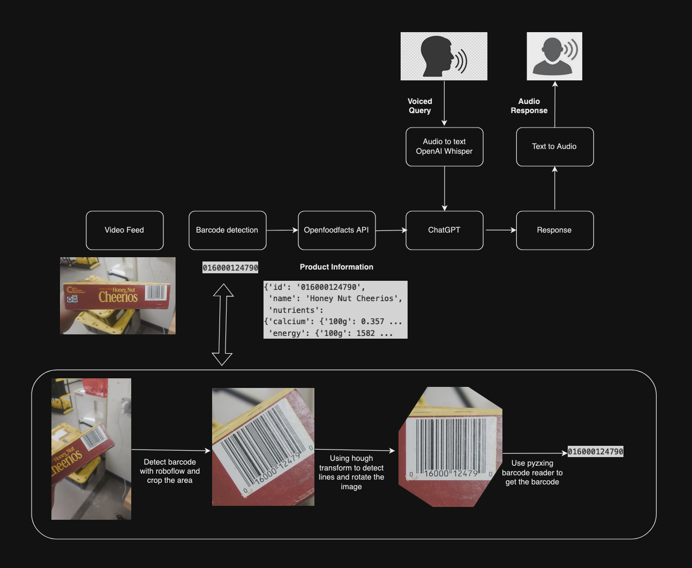

## Shelfhelp - Fall 2023 Product identification


This repository contains experiments done on visual representation learning models and Barcode detection. Here are the list of things which will be elaborated further below
1. Use Image processing techniques to detect barcode as a baseline model.
2. Object detection for rotated 1D barcode using Maximal Stable Extremal Region (MSER) method.
3. Test different methods like pyzbar, pyzxing to read barcodes.
4. Barcode detection using Roboflow and rotating using Hough transform lines.
5. Add ChatGPT to be used for answering queries about the product.
6. Use Openai whisper and text to audio feature to communicate.


As a part of my independent study for Fall 2023, I worked with Shivendra Agrawal who is currently working towards developing a smartcane to help visually impaired and blind people to guide them in grocery shopping.

During my independent study, I tested visual representation learning models, developed barcode detector and built an end to end pipeline which takes in live video input to detect the barcode and further answer queries about the product. In this process, I read research papers and blogs about MAE, PAWS for visual representation learning and few papers on barcode detection. Created a pipeline for identifying the product and querying about the same, used ChatGPT and Openai whispers in my project for communication.

Papers:
- 
- 
- 
- 
- 

Blogs:
- https://medium.com/invisible-insights/barcode-detection-using-deep-learning-techniques-1abde201df08
- https://blog.roboflow.com/read-barcodes-computer-vision/
- https://platform.openai.com/docs/guides/speech-to-text/quickstart
- https://baresquare.com/blog/use-openai-chatgpt-with-python
- https://github.com/dchakour/Barcode-detection


Barcode detection:

Imagine a visually impaired person is trying to buy few food products in the grocery store. Shelf help's camera can act as eyes and help find and learn about different products. 

A person can scan through the products one after the other, and the algorithm detects the product, voicing out the name of the product the person is holding. If the person finds a product but would like to inquire about it to get more information, such as nutrition facts, allergens, protein content, ingredients, etc., this algorithm is designed to assist. The person can engage in a conversation to learn more about the product.

Here is the pipeline and step by step working of the workflow.
1. Input to the pipeline can be live video or recorded videos. In the video, the product must be scanned to show all sides of the product.

2. The algorithm uses the Roboflow barcode detection algorithm to identify barcodes in the frame. For higher speed, the algorithm is run every 30 frames.

3. The barcode is cropped, and a Hough line transform is employed to detect the angle of the barcode.

4. The barcode is then rotated by the determined angle, ensuring it becomes horizontal.

5. The pyzbar and pyzxing libraries are utilized to decode the barcoded image.

6. For database access, the Openfoodfacts API (https://world.openfoodfacts.org/api/v0/product/%20) is employed to retrieve product information in JSON format.

7. Necessary information is filtered from the JSON and sent to the GPT-3.5 API.

8. Simultaneously, a Text-to-Audio feature is utilized to voice over the product name.

9. If the identified product is not the target, the person can say "continue" to proceed with scanning other products.

10. If the target product is reached, the person can proceed to query information about the product if needed.

11. OpenAI whisper is used to convert speech to text with accuracy

The image below shows the process pipeline.


Setup:
1. Clone the repository ``` git clone https://github.com/Shanthi-Lekkala/ProductIdentification.git```
2. Create a new virtual env with python-3.9.12  ```conda create -n env python=3.9.12```
2. Install the requirements ```pip install -r requirements.txt```
3. Set the OpenAI API key in *utils/config.py* 
4. Run main.py, ```python main.py```

Experiments done:
1. Detecting Barcode with Image processing techniques: 
  - Compute Gradient magnitude representations of the image in both x and y directions, apply thresholding, apply morphological operation to close gaps between bars, find countours and draw a rectangle.
  Observations:
  1. This method can detect barcodes very fast, but they might not be accurate.
  2. It can also detect angled barcodes and give us a rotated rectangle
2. Detection based on MSER:
  - It takes advantage of Maximal Stable Extremal Region (MSER) system introduced by _"Robust wide
baseline stereo from maximally stable extremal regions"_


